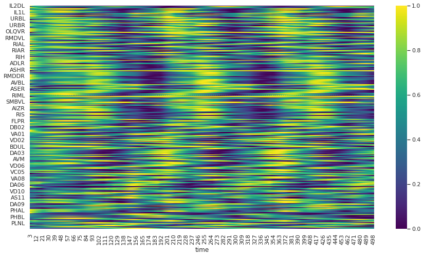

# C.eleans control backbone and behavioral repertoires

This project includes four steps:
1. Defining and simulating the behaviour
2. Classifying neuronal dynamics associated with the behaviour
3. Systematically destroy the network and determine if it can reproduce these dynamics
4. Select the smallest such network(s).

## About the project
C.elegans (~1mm long roundworm) is a well-established model organism with a fully mapped neuronal network. It is an ideal subject for in silico simulations and we have a comprehensive understanding of its stereotyped behaviors and neuronal dynamics due to the in-vivo imaging of the whole-brain function.
Understanding the structure of neuronal networks that underlie specific behaviors is a fundamental challenge in neuroscience. The brain is an incredibly complex organ, with many redundant connections and a remarkable ability to adapt to different situations. However, this adaptability comes at a cost, as the brain can also be vulnerable to damage and injury. By identifying the minimal network structure necessary to support specific behaviors, we can gain insights into the brain's robustness and vulnerability, and ultimately develop new treatments for neurological disorders.
The goal of this study is to identify the minimal network structure in terms of the number of nodes and edges required to support a behavior. C. elegans has a surprisingly diverse range of behaviors for an organism with only 302 neurons. We start by the simulation of gentle and harsh touch behaviors in the neuronal network of C.elegans. The simulation is based on the stimulation of specific sensory neurons with varying input amplitudes. Supervised learning models are then trained to classify the simulations based on their ability to reproduce the dynamics associated with either the harsh or gentle touch response. 
Moving forward, we aim to identify the minimal network structure underlying the harsh and gentle touch behaviors in C.elegans by perturbing the wiring diagram and investigating whether the stimulation of the same mechanosensory neurons can reliably evoke the harsh and gentle touch response. By understanding these minimal networks, we hope to gain a deeper understanding of the brain's incredible complexity and adaptability, and ultimately help to unlock its full potential.

